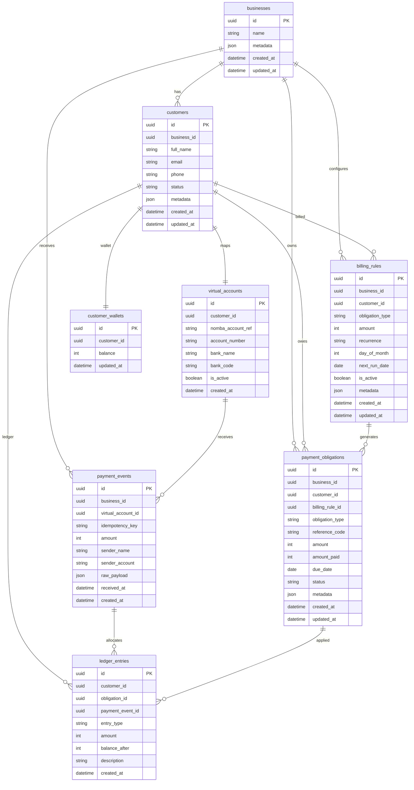
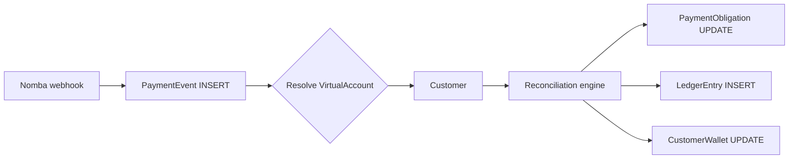

# Ledger-Core — PostgreSQL schema design

Transactional schema for customer virtual accounts, payment obligations, inbound transfers, reconciliation, and immutable ledger entries.

**Implementation:** `server/db/migrations/20260627100000_initial_schema.ts`  
**Amounts:** kobo (`BIGINT`) — Nomba uses kobo; 1 NGN = 100 kobo (e.g. ₦1,500 → `150000`)  
**Status:** MVP single-business; `business_id` on all tenant-scoped tables for future multi-business SaaS.

---

## ER diagram

> Diagram uses simplified types for GitHub Mermaid compatibility. See [Entity reference](#entity-reference) and [Indexes](#indexes) for full PostgreSQL types, keys, and constraints.



---

## Entity reference

### Business

Single-tenant MVP anchor. Every customer, obligation, and payment event belongs to one business. Multi-business SaaS adds row-level isolation on `business_id` without schema changes.

| Column     | Type        | Notes                          |
|------------|-------------|--------------------------------|
| `id`       | UUID PK     |                                |
| `name`     | TEXT        | Display name                   |
| `metadata` | JSONB       | Extensible business config     |

---

### Customer

End payer profile. One virtual account per customer in MVP.

| Column        | Type              | Notes                    |
|---------------|-------------------|--------------------------|
| `full_name`   | TEXT              |                          |
| `email`       | TEXT              | Optional                 |
| `phone`       | TEXT              | Optional                 |
| `status`      | `customer_status` | `ACTIVE` \| `INACTIVE`   |
| `metadata`    | JSONB             | Contact / custom fields  |

---

### VirtualAccount

Nomba virtual account mapped 1:1 to a customer. Webhook handler resolves customer by `account_number` or `nomba_account_ref`.

| Column              | Type    | Notes                              |
|---------------------|---------|------------------------------------|
| `nomba_account_ref` | TEXT UK | Nomba `accountRef`                 |
| `account_number`    | TEXT    | Bank account number (webhook lookup)|
| `bank_name`         | TEXT    |                                    |
| `bank_code`         | TEXT    | Optional                           |
| `is_active`         | BOOLEAN | Soft-disable without delete        |

---

### PaymentObligation

Generic expected payment — invoice, subscription/MBU, fee, levy, or custom. Core of the universal reconciliation model (TASK.md §4.1).

| Column           | Type                | Notes                                           |
|------------------|---------------------|-------------------------------------------------|
| `obligation_type`| `obligation_type`   | `INVOICE` \| `SUBSCRIPTION` \| `FEE` \| `LEVY` \| `CUSTOM` |
| `reference_code` | TEXT                | Human/API reference (e.g. `INV-2026-001`)       |
| `amount`         | BIGINT              | Total due (kobo)                                |
| `amount_paid`    | BIGINT              | Running total applied (kobo)                    |
| `due_date`       | DATE                | Used for aging / OVERDUE                        |
| `status`         | `obligation_status` | `UNPAID` \| `PARTIAL` \| `PAID` \| `OVERDUE`    |
| `billing_rule_id`| UUID FK             | Set when auto-generated from a billing rule     |
| `metadata`       | JSONB               | Period labels, line items, etc.                 |

**Status transitions (application layer):**

| Scenario        | `amount_paid` vs `amount` | Status    |
|-----------------|---------------------------|-----------|
| No payment      | `0`                       | `UNPAID`  |
| Partial         | `0 < paid < amount`       | `PARTIAL` |
| Full payment    | `paid >= amount`          | `PAID`    |
| Past due, open  | unpaid/partial + past due | `OVERDUE` |

Overpayment excess flows to `customer_wallets`, not `amount_paid`.

---

### BillingRule

Recurrence config for auto-generating obligations (e.g. ₦6,000 monthly MBU on the 1st).

| Column          | Type              | Notes                              |
|-----------------|-------------------|------------------------------------|
| `recurrence`    | TEXT              | `MONTHLY`, `WEEKLY`, etc.          |
| `day_of_month`  | SMALLINT          | 1–28 for monthly rules             |
| `next_run_date` | DATE              | Next obligation generation date    |
| `is_active`     | BOOLEAN           | Pause without delete               |

---

### PaymentEvent

Raw inbound transfer captured from Nomba webhook. Insert-only audit record.

| Column             | Type        | Notes                                    |
|--------------------|-------------|------------------------------------------|
| `idempotency_key`  | TEXT UK     | Nomba transaction/request ID — dedup key |
| `amount`           | BIGINT      | Transfer amount (kobo)                   |
| `sender_name`      | TEXT        | From webhook payload                     |
| `sender_account`   | TEXT        | From webhook payload                     |
| `raw_payload`      | JSONB       | Full webhook body for audit              |
| `received_at`      | TIMESTAMPTZ | Bank transfer timestamp                  |

---

### LedgerEntry

Immutable debit/credit row — source of truth for allocation history (TASK.md §5.2, §7 Feature 5).

| Column             | Type                | Notes                                      |
|--------------------|---------------------|--------------------------------------------|
| `entry_type`       | `ledger_entry_type` | `DEBIT` \| `CREDIT`                        |
| `amount`           | BIGINT              | Entry amount (always positive)             |
| `balance_after`    | BIGINT              | Running outstanding or wallet balance snap |
| `obligation_id`    | UUID FK             | Nullable — wallet credits omit obligation  |
| `payment_event_id` | UUID FK             | Source transfer                            |
| `description`      | TEXT                | Human-readable allocation note             |

**Append-only policy:** see [Ledger append-only](#ledger-append-only-policy).

---

### CustomerWallet

Unallocated / overpayment credit per customer. One row per customer; balance updated when excess is credited or applied to future obligations.

| Column    | Type   | Notes                        |
|-----------|--------|------------------------------|
| `balance` | BIGINT | ≥ 0; kobo                    |

Wallet balance changes are also reflected in `ledger_entries` for a full audit trail.

---

## Enums

```sql
customer_status    ACTIVE | INACTIVE
obligation_type    INVOICE | SUBSCRIPTION | FEE | LEVY | CUSTOM
obligation_status  UNPAID | PARTIAL | PAID | OVERDUE
ledger_entry_type  DEBIT | CREDIT
```

---

## Indexes

| Acceptance requirement        | Index / constraint                                      | Table               |
|-------------------------------|---------------------------------------------------------|---------------------|
| Virtual account lookup        | `UNIQUE (nomba_account_ref)`                            | `virtual_accounts`  |
| Virtual account lookup        | `INDEX (account_number)`                                | `virtual_accounts`  |
| Customer obligations          | `INDEX (customer_id)`                                   | `payment_obligations` |
| Customer obligations          | `INDEX (status)`                                        | `payment_obligations` |
| Customer obligations          | `INDEX (customer_id, status)` — open obligation queries | `payment_obligations` |
| Customer obligations          | `INDEX (due_date)` — aging / FIFO ordering              | `payment_obligations` |
| Payment idempotency key       | `UNIQUE (idempotency_key)`                              | `payment_events`    |
| Webhook → VA resolution       | `INDEX (virtual_account_id)`                            | `payment_events`    |
| Customer ledger history       | `INDEX (customer_id, created_at)`                       | `ledger_entries`    |
| Obligation payment history    | `INDEX (obligation_id)`                                 | `ledger_entries`    |

---

## Ledger append-only policy

`ledger_entries` and `payment_events` are **insert-only**. The application layer must never `UPDATE` or `DELETE` these rows.

| Rule | Rationale |
|------|-----------|
| No `UPDATE` on `ledger_entries` | Preserves immutable audit trail per customer |
| No `DELETE` on `ledger_entries` | Corrections are new compensating entries, not edits |
| No `UPDATE`/`DELETE` on `payment_events` | Raw webhook evidence must not be altered |
| `payment_obligations` may update | `amount_paid` and `status` change during reconciliation |
| `customer_wallets.balance` may update | Derived running balance; ledger entries record each change |

Enforced in code via repository/query conventions — only `INSERT` paths for ledger and payment events. See `CONTRIBUTION_GUIDE.md`.

---

## Data flow (reconciliation)



1. Webhook creates `payment_event` (idempotency check on `idempotency_key`).
2. Customer resolved via `virtual_accounts.account_number`.
3. Engine matches obligation (exact amount → FIFO).
4. Engine updates `payment_obligations.amount_paid` / `status`.
5. Engine inserts `ledger_entries` for each allocation.
6. Overpayment inserts wallet `ledger_entry` and updates `customer_wallets.balance`.

---

## Reporting views

Defined in `server/db/migrations/20260627100001_reporting_views.ts` and `20260627100002_update_reporting_views.ts` (issue #4):

- `v_customer_balance_summary` — outstanding + wallet credit per customer
- `v_obligation_aging` — per-obligation aging buckets
- `v_obligation_aging_summary` — aggregated bucket totals per business
- `v_business_metrics` — inflow, outstanding, overdue totals
- `v_obligation_payment_history` — allocations per obligation

Example queries and API endpoints: [`docs/REPORTING_VIEWS.md`](./REPORTING_VIEWS.md).

---

## Example queries

**Resolve customer from inbound transfer account number:**

```sql
SELECT c.*
FROM virtual_accounts va
JOIN customers c ON c.id = va.customer_id
WHERE va.account_number = $1 AND va.is_active = TRUE;
```

**Open obligations for FIFO allocation (oldest first):**

```sql
SELECT *
FROM payment_obligations
WHERE customer_id = $1
  AND status IN ('UNPAID', 'PARTIAL', 'OVERDUE')
ORDER BY due_date ASC, created_at ASC;
```

**Idempotency check on webhook replay:**

```sql
SELECT id FROM payment_events WHERE idempotency_key = $1;
```

---

## Team review checklist

- [ ] Entity set covers invoice + subscription (MBU) flows from TASK.md §6
- [ ] `business_id` scoping supports future multi-tenant without migration
- [ ] Indexes cover webhook lookup, obligation matching, and idempotency
- [ ] Append-only ledger policy agreed for `ledger_entries` and `payment_events`
- [ ] Amounts stored in kobo (matches Nomba webhook `transactionAmount`)

**Reviewers:** leave a comment on issue #2 or PR to sign off.
